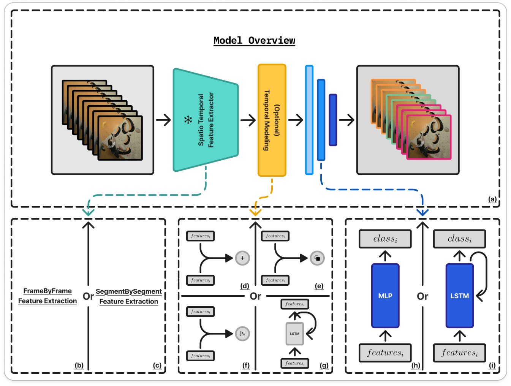

# Bouldering Video (Action) Segmentation

This repository contains the code related to my 120 hours research project that consist in Bouldering Video (Action) Segmentation.

Below you'll be able to find instructions related to how to train and do inference using the model / repository's code.

For a detailed report on the model and the approach that was used, please refer to the [PDF report](https://google.com) of the research project.



## Pre-Trained Models

A detailed list of pre-trained models and their weights can be found in **[models-weights/mlp.README.md](models-weights/mlp.README.md)** or **[models-weights/lstm.README.md](models-weights/lstm.README.md)**. A resumed list can also be found just below.

| Backbone |  Backbone Type   | MLP Accuracy      | LSTM Accuracy     | #Parameters | Weights                                                                         |
| :------- | :--------------: | :---------------- | :---------------- | :---------: | ------------------------------------------------------------------------------- |
| yolo     | `FRAME_BY_FRAME` | 65.01% ± 4.41     | 69.94% ± 2.40     |    2.9M     | [MLP](models-weights/mlp.yolo.pt) / [LSTM](models-weights/lstm.yolo.pt)         |
| dino     | `FRAME_BY_FRAME` | 80.58% ± 4.56     | 83.20% ± 3.26     |    22.1M    | [MLP](models-weights/mlp.dino.pt) / [LSTM](models-weights/lstm.dino.pt)         |
| r3d      |    `TEMPORAL`    | 84.27% ± 5.03     | 85.68% ± 3.64     |    31.6M    | [MLP](models-weights/mlp.r3d.pt) / [LSTM](models-weights/lstm.r3d.pt)           |
| i3d      |    `TEMPORAL`    | 76.53% ± 8.81     | 79.38% ± 5.11     |    12.7M    | [MLP](models-weights/mlp.i3d.pt) / [LSTM](models-weights/lstm.i3d.pt)           |
| clip     | `FRAME_BY_FRAME` | 76.49% ± 2.36     | 79.92% ± 2.74     |   151.3M    | [MLP](models-weights/mlp.clip.pt) / [LSTM](models-weights/lstm.clip.pt)         |
| x3d-xs   |    `TEMPORAL`    | 82.11% ± 3.73     | 83.87% ± 2.68     |    3.0M     | [MLP](models-weights/mlp.x3d-xs.pt) / [LSTM](models-weights/lstm.x3d-xs.pt)     |
| x3d-s    |    `TEMPORAL`    | **85.28% ± 4.54** | 85.84% ± 3.63     |    3.0M     | [MLP](models-weights/mlp.x3d-s.pt) / [LSTM](models-weights/lstm.x3d-s.pt)       |
| x3d-m    |    `TEMPORAL`    | 85.01% ± 4.75     | **86.61% ± 2.32** |    3.0M     | [MLP](models-weights/mlp.x3d-m.pt) / [LSTM](models-weights/lstm.x3d-m.pt)       |
| x3d-l    |    `TEMPORAL`    | 84.65% ± 4.10     | 85.91% ± 2.32     |    5.3M     | [MLP](models-weights/mlp.x3d-l.pt) / [LSTM](models-weights/lstm.x3d-l.pt)       |
| s3d-k    |    `TEMPORAL`    | 78.08% ± 5.20     | 78.04% ± 3.33     |    7.9M     | [MLP](models-weights/mlp.s3d-k.pt) / [LSTM](models-weights/lstm.s3d-k.pt)       |
| s3d-h    |    `TEMPORAL`    | 59.37% ± 9.10     | 47.19% ± 6.22     |    9.7M     | [MLP](models-weights/mlp.s3d-h.pt) / [LSTM](models-weights/lstm.s3d-h.pt)       |
| slowfast |    `TEMPORAL`    | 84.22% ± 3.07     | 82.49% ± 4.61     |    33.6M    | [MLP](models-weights/mlp.slowfast.pt) / [LSTM](models-weights/lstm.slowfast.pt) |
| vivit    |    `TEMPORAL`    | 78.42% ± 3.70     | 81.41% ± 3.75     |    88.6M    | [MLP](models-weights/mlp.vivit.pt) / [LSTM](models-weights/lstm.vivit.pt)       |

## Inference

**Note:** Beside the explanation below, a notebook version with a detailed step by step guidecan also be found in the [`example.inference.ipynb`](example.inference.ipynb) notebook.

First of all you need to install the package:

```bash
pip install git+https://github.com/raideno/bouldering-video-segmentation.git
```

Now you'll need to download the weights of the model you wish to use from the [Pre-Trained Models](#pretrained-models) section.

Once this is done you can use the code below in order to test the model on a video. An example video can be found here if necessary: [example-bouldering-video.mp4](https://google.com).

**Note**: For a detailed inference example you can refer to one of [`bouldering_video_segmentation/inference.py`](bouldering_video_segmentation/inference.py) or [`example.inference.ipynb`](example.inference.ipynb).

```python
from tas_helpers.visualization import SegmentationVisualizer

from bouldering_video_segmentation.inference import segment_video
from bouldering_video_segmentation.utils import LabelEncoderFactory
# --- --- --- ---

VIDEO_PATH = "./climbing-video.mp4"

# --- --- --- ---

frames_predictions = segment_video(VIDEO_PATH)

# --- --- --- ---

label_encoder = LabelEncoderFactory.get()

visualizer = SegmentationVisualizer(
    labels_values=label_encoder.transform(label_encoder.classes_),
    labels_names=label_encoder.classes_
)

visualizer.plot_segmentation(
    frames_labels=frames_predictions,
    fps=25
)
```

```python
extractor, classifier = torch.hub.load("raideno/bouldering-video-segmentation", "mlp", backbone_name="x3d-xs", pretrained=True)

```

## Training the Model

0. Start by cloning the github repository: `git clone git@github.com:raideno/bouldering-video-segmentation.git`.
1. Download the dataset available at [https://google.com](https://google.com).
2. Follow the instructions in the notebook [`experiments/preliminary.ipynb`](experiments/preliminary.ipynb).
3. Depending on which model you want to train on, follow the instructions in one of the two following notebooks:
   1. Mlp: [`experiments/mlp.experiments.ipynb`](experiments/mlp.experiments.ipynb).
   2. Lstm: [`experiments/lstm.experiments.ipynb`](experiments/lstm.experiments.ipynb).

## Accessing the Dataset

As the dataset contains pictures and videos of climbers who didn't necessarily agree for their videos to be made publicly available, in order to access the dataset please contact me at: [nadirkichou@hotmail.fr](mailto:nadirkichou@hotmail.fr).
